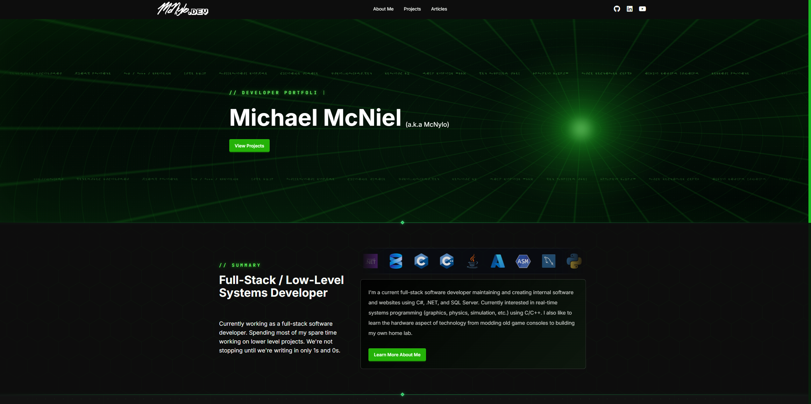

[](https://mcnylo.dev)
# Developer Portfolio Website (mcnylo.dev)

mcnylo.dev is my developer portfolio website built with ASP.NET Core MVC.

The website presents software projects, technical articles, professional experience, and resume information. It also includes a protected administration system for site content.

[View the live website](https://mcnylo.dev)

## Features

### Public Website

- Display featured software projects.
- Browse projects by category and tag.
- Display project descriptions, media, repository links, and related articles.
- Identify projects that use private repositories.
- Publish technical articles from Markdown content.
- Display syntax highlighting in article code blocks.
- Display an editable About page.
- Provide a downloadable resume.
- Support desktop and mobile layouts.

### Administration System

- Create, preview, edit, and delete projects.
- Create, preview, edit, and delete articles.
- Manage project and article categories.
- Manage reusable tags.
- Upload project and article images.
- Upload and replace the resume PDF.
- Select primary media for each project.
- Review stored media and its references.
- Delete media that is not referenced by site content.
- Edit the public About page.

### Content Processing

- Convert Markdown to HTML.
- Sanitize generated HTML before display.
- Support code blocks, tables, figures, blockquotes, and selected HTML elements.
- Apply syntax highlighting to article code.
- Generate thumbnails for supported YouTube media.

### Security

- Use cookie-based authentication for the administration system.
- Support authenticator-app multi-factor authentication.
- Generate recovery codes for administrator access.
- Rate-limit administrator login and verification requests.
- Validate anti-forgery tokens on data-changing requests.
- Protect temporary authentication data with ASP.NET Core Data Protection.
- Use secure, HTTP-only cookies.
- Apply a Content Security Policy and other HTTP security headers.
- Sanitize article HTML before rendering it.

## Application Design

The application uses a feature-based directory structure.

Each public feature contains its own controllers, services, view models, and Razor views. Entity Framework Core stores site content in a MySQL-compatible database.

The main application areas are:

- `Home` for the landing page and featured projects.
- `Projects` for project listings and project details.
- `Articles` for article listings, Markdown conversion, and article details.
- `About` for professional and resume information.
- `Admin` for content and media management.
- `Media` for file storage and upload services.
- `Data` for the database context and data models.

Project and article records use categories and tags. Uploaded files are stored on the file system. Database records store the public paths and content relationships.

## Technology

- ASP.NET Core MVC
- Entity Framework Core
- MySQL
- HTML
- JavaScript
- Tailwind CSS
- Markdig
- HTML sanitization
- Docker
- GitHub Actions
- GitHub Container Registry

## Local Development

### Requirements

- .NET 10 SDK
- Node.js 22 or later
- npm
- A MySQL-compatible database

Docker is optional.

### Clone the Repository

```bash
git clone https://github.com/mcnylo/mcnylo.dev.git
cd mcnylo.dev/mcnylo.dev
```

### Install Dependencies

```bash
npm ci
dotnet restore
```

### Build the CSS

```bash
npm run css:build
```

### Configuration

The application reads its database connection from `ConnectionStrings:DBConnection`.

Use environment variables, .NET user secrets, or a local configuration file that is not committed to source control.

Environment variables use double underscores for nested configuration keys:

```text
ConnectionStrings__DBConnection
MediaStorage__RootPath
MediaStorage__RequestPath
DataProtection__KeyPath
```

Example database connection string:

```text
Server=localhost;Port=3306;Database=mcnylodb;User=application-user;Password=replace-this-value;
```

The media directory and Data Protection key directory must be writable by the application.

### Run the Application

```bash
dotnet run
```

Open the local address that ASP.NET Core displays in the terminal.

## Docker

The Dockerfile uses separate stages for the CSS build, .NET build, and application runtime.

Build the image from the repository root:

```bash
docker build -t mcnylo-dev .
```

Run the image:

```bash
docker run --rm \
  -p 8080:8080 \
  -e ConnectionStrings__DBConnection="Server=database-host;Port=3306;Database=mcnylodb;User=application-user;Password=replace-this-value;" \
  -v mcnylo-media:/var/lib/mcnylo/media \
  -v mcnylo-keys:/var/lib/mcnylo/keys \
  mcnylo-dev
```

Open `http://localhost:8080`.

## Deployment

The GitHub Actions workflow runs after a push to the `master` branch. It can also run manually.

The workflow performs these operations:

1. Check out the repository.
2. Build the Docker image.
3. Push the image to GitHub Container Registry.
4. Connect to the deployment server through SSH.
5. Pull the new image with Docker Compose.
6. Restart the website container.
7. Remove unused Docker images.

The deployment stores uploaded media and Data Protection keys outside the container. This storage remains available when the container is replaced.
